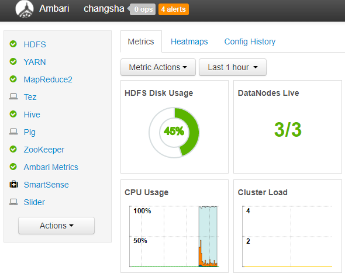

# Ambari cluster deploy
## 要求
|     名称     |        条件        |                           备注                            |
| ------------ | ------------------ | --------------------------------------------------------- |
| 主机数量     | 3+                 |                                                           |
| 内存容量     | 2G+                |                                                           |
| 磁盘大小     | 10G+               |                                                           |
| 使用私有网段 | 192.168.70.xxx     | 虚拟机通过host-only组成局域网+NAT方式访问办公网络         |
| 使用办公网段 | 192.168.36.xxx     | 或者虚拟机通过桥接模式接入办公网络，与REPO-SERVER同一网段 |
| 主机所在域   | bigdata.wh.com     |                                                           |
| 主机名限制   | xxx.bigdata.wh.com | repo和proxy已经被使用                                     |

## 规划
|         主机         |       IP       |                  组件                  |
| -------------------- | -------------- | -------------------------------------- |
| repo.bigdata.wh.com  | 192.168.36.239 | reposerver + nameserver + ntpsrver     |
| proxy.bigdata.wh.com | 192.168.36.245 | rpm proxy cache                        |
| hdp.bigdata.wh.com   | 192.168.70.100 | ambari + pg + nn + gw                  |
| host1.bigdata.wh.com | 192.168.70.101 | rsMgr + snn + dn + nodeMgr + zk        |
| host2.bigdata.wh.com | 192.168.70.102 | hive + dn + nodeMgr + zk               |
| host3.bigdata.wh.com | 192.168.70.103 | activity + Metrics + dn + nodeMgr + zk |

## 过程
### 初始化环境
* 使用Vagrant创建虚拟机

下载vagrant配置目录，Git地址为: `git@github.com:daowoo/ambari-deploy.git`，检查Vagrantfile中配置的box是否存在（vagrant box list），不存在则添加（vagrant box add 'name' 'box_path'）。然后执行如下命令：
```shell
vagrant up hdp
vagrant up host1
vagrant up host2
vagrant up host3
```

* 其他方式创建虚拟机

虚拟机创建后记得检查网络状态，看能否与REPO-SERVER进行交互，接下来就执行以下脚本完成初始化。
```shell
cat << 'eof' > download.sh
#!/usr/bin/env bash

reposerver="192.168.36.239"

# timezone config
echo 'modify lang and timezone'
sudo localectl set-locale LANG=en_US.utf8
sudo timedatectl set-timezone Asia/Shanghai

# download and exec initenv.sh
curl -O http://${reposerver}/resource/initenv.sh
chmod +x initenv.sh
./initenv.sh

echo "Environment initialization completed, OK!"
eof

sh download.sh
```

* 更新nameserver中的A记录&&IP记录

如果虚拟机hostname或ipaddr与上面示例中的不同，登录NAMESERVER在bigdata.wh.com域中添加相应的A记录和IP记录。
```shell
ssh vagrant@192.168.36.239
password:vagrant

cat /var/named/bigdata.wh.com.zone
cat /var/named/168.192.in-addr.arpa.zone
```

* 完成ssh免密登录配置
```shell
ssh host1.bigdata.wh.com
ssh host2.bigdata.wh.com
ssh host3.bigdata.wh.com
ssh host4.bigdata.wh.com
```

### 安装PG

* 安装postgresql95相关的二进制包，完成环境配置和数据库初始化。
```shell
echo 'INSTALL PG'
yum install -y postgresql95-server.x86_64
yum install -y postgresql95-contrib.x86_64

echo 'CONFIG PG PATH'
cat << 'eof' > /var/lib/pgsql/.pgsql_profile
export PATH=$PATH:/usr/pgsql-9.5/bin/
eof

echo 'INIT AND CONFIG PG'
su postgres
source ~/.bash_profile

initdb -U postgres -W
sed -i -e '/^#listen_addresses =/s/^#//' -e '/^#port =/s/^#//' -e "/listen_addresses =.*/s@=.*@= '*'@" /var/lib/pgsql/9.5/data/postgresql.conf
sed -i '/# IPv6 local connections:/i host    all             all             0.0.0.0/0               md5' /var/lib/pgsql/9.5/data/pg_hba.conf

echo 'START PG'
pg_ctl start -D /var/lib/pgsql/9.5/data/
ss -tpnl |grep 5432
pg_ctl stop
```

* 配置PG服务自启动。
```shell
echo 'ENABLE PG SERVICE'
systemctl enable postgresql-9.5.service
systemctl start postgresql-9.5.service
```

* 创建ambari和hive所使用的数据库实例和用户。
```sql
echo 'CREATE AMBARI DATABASE'
sudo -u postgres psql
CREATE DATABASE ambari;
CREATE USER ambari WITH PASSWORD '1';
GRANT ALL PRIVILEGES ON DATABASE ambari TO ambari;

\c ambari
CREATE SCHEMA ambari AUTHORIZATION ambari;
ALTER SCHEMA ambari OWNER TO ambari;
ALTER ROLE ambari SET search_path to 'ambari', 'public';
\q

echo 'CREATE HIVE DATABASE'
sudo -u postgres psql
CREATE DATABASE hive;
CREATE USER hive WITH PASSWORD '1';
GRANT ALL PRIVILEGES ON DATABASE hive TO hive;

\c hive
CREATE SCHEMA hive AUTHORIZATION hive;
ALTER SCHEMA hive OWNER TO hive;
ALTER ROLE hive SET search_path to 'hive', 'public';
\q

echo 'CREATE RANGER DATABASE'
sudo -u postgres psql
CREATE DATABASE ranger;
CREATE USER ranger WITH PASSWORD '1';
GRANT ALL PRIVILEGES ON DATABASE ranger TO ranger;

\c ranger
CREATE SCHEMA ranger AUTHORIZATION ranger;
ALTER SCHEMA ranger OWNER TO ranger;
ALTER ROLE ranger SET search_path to 'ranger', 'public';
\q

```


### 安装Ambari
* install ambari server
```shell
yum install -y ambari-server.x86_64
```

* ambari database shcema
```sql
echo 'INIT AMBARI DATABASE SHCEMA'
psql -U ambari -d ambari
\i /var/lib/ambari-server/resources/Ambari-DDL-Postgres-CREATE.sql
\d
\q
```

* config jdk&&jce&&jdbc
```shell
echo 'COPY JDK AND JCE'
scp vagrant@repo.bigdata.wh.com:/home/repo/resource/jdk-8u112-linux-x64.tar.gz /var/lib/ambari-server/resources/
scp vagrant@repo.bigdata.wh.com:/home/repo/resource/jce_policy-8.zip /var/lib/ambari-server/resources/

echo 'CONFIG JDBC'
scp vagrant@repo.bigdata.wh.com:/home/repo/resource/postgresql-jdbc.jar /root/
ambari-server setup --jdbc-db=postgres --jdbc-driver=/root/postgresql-jdbc.jar
```

* setup
```shell
ambari-server setup

Customize user account for ambari-server daemon [y/n] (n)? n
JDK Enter choice (1): 1
Enter advanced database configuration [y/n] (n)? y
database options Enter choice (1): 4
Hostname (localhost): hdp.bigdata.wh.com
Port (5432):
Database name (ambari):
Postgres schema (ambari):
Username (ambari):
Enter Database Password (bigdata):123
Proceed with configuring remote database connection properties [y/n] (y)? y
```

* start
```shell
ambari-server start
```

### 部署组件
* HDP-2.6.1.0之后SmartSense是必选的收费组件，安装之后可以`Delete`或`Turn on Maintenance`。
* `Hive Metastore`和`HiveServer2`默认是Local方式，可以手动调整为Remote。
* 配置Hive连接meta外部PG数据库时，需要首先完成jdbc的setup。
* 配置Grafana管理员密码时不能够太短，最好超过八个字符，否则在启动过程中会因为密码验证问题导致部分服务无法启动。

### 启动组件



Virutalbox存放VM的路径找到你的虚拟机的文件夹并进入
# 记录原来磁盘文件的uuid
vboxmanage showhdinfo "centos-vm-disk1.vmdk"

UUID: c4d43703-0f2c-462a-bb0f-427d938b8c15

# Clone the .vmdk image to a .vdi.
vboxmanage clonehd "centos-vm-disk1.vmdk" "new-virtualdisk.vdi" --format vdi

# Resize the new .vdi image (30720 == 30 GB).
vboxmanage modifyhd "new-virtualdisk.vdi" --resize 30720

# Optional; switch back to a .vmdk.
VBoxManage clonehd "new-virtualdisk.vdi" "resized.vmdk" --format vmdk
vboxmanage showhdinfo "resized.vmdk"

# 进入系统后通过cfdisk工具来创建主分区
cfdisk /dev/sda
/*需要主要的是分区type必须为Linux LVM(8e)*/

# 利用pvcreate命令给新的分区创建物理卷
pvcreate /dev/sda3

# 查看VG Name，我自己的VG Name是centos
pvdisplay

# 新分区扩展到centos这个组
vgextend centos /dev/sda3

# 扩展逻辑分区
lvextend /dev/mapper/centos-root /dev/sda3

# 变更生效
xfs_growfs /dev/mapper/centos-root
