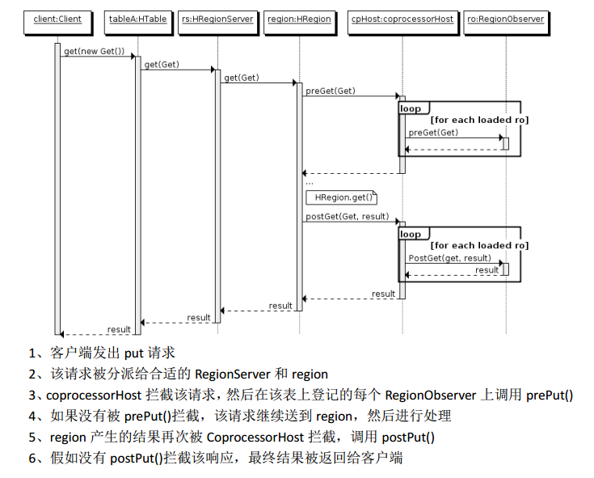
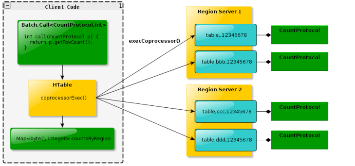

# Coprocessor
## 为什么要引入
Hbase 作为列族数据库最经常被人诟病的特性包括：无法轻易建立“二级索引”，难以执 行求和、计数、排序等操作。比如，为了统计数据表的总行数，需要使用 Counter 方法，执行一次 MapReduce Job 才能得到。虽然 HBase 在数据存储层中集成了 MapReduce，能够有效用于数据表的分布式计算。然而在很多情况下，做一些简单的相 加或者聚合计算的时候， 如果直接将计算过程放置在 server 端，能够减少通讯开销，从而获 得很好的性能提升。于是， HBase 在 0.92 之后引入了coprocessors，它能够轻易建立二次索引、复杂过滤器(谓词下推)以及访问控制等。

## 哪些种类
### observer
 Observer 类似于传统数据库中的触发器，当发生某些事件的时候这类协处理器会被 Server 端调用。Observer Coprocessor 就是一些散布在 HBase Server 端代码中的 hook 钩子， 在固定的事件发生时被调用。比如： put 操作之前有钩子函数 prePut，该函数在 put 操作
执行前会被 Region Server 调用；在 put 操作之后则有 postPut 钩子函数

* RegionObserver：提供客户端的数据操纵事件钩子： Get、 Put、 Delete、 Scan 等
* WALObserver：提供 WAL 相关操作钩子
* MasterObserver：提供 DDL-类型的操作钩子。如创建、删除、修改数据表等
* RegionServerObserver：提供针对对region的管理操作钩子

### endpoint
协处理器类似传统数据库中的存储过程，客户端可以调用这些 Endpoint 协处 理器执行一段 Server 端代码，并将 Server 端代码的结果返回给客户端进一步处理，最常 见的用法就是进行聚集操作。如果没有协处理器，当用户需要找出一张表中的最大数据，即max 聚合操作，就必须进行全表扫描，在客户端代码内遍历扫描结果，并执行求最大值的 操作。这样的方法无法利用底层集群的并发能力，而将所有计算都集中到 Client 端统一执 行，势必效率低下。利用 Coprocessor，用户可以将求最大值的代码部署到 HBase Server 端，HBase 将利用底层 cluster 的多个节点并发执行求最大值的操作。即在每个 Region 范围内 执行求最大值的代码，将每个 Region 的最大值在 Region Server 端计算出，仅仅将该 max 值返回给客户端。在客户端进一步将多个 Region 的最大值进一步处理而找到其中的最大值，这样整体的执行效率就会提高很多。

### 差异对比
* Observer 允许集群在正常的客户端操作过程中可以有不同的行为表现
* Endpoint 允许扩展集群的能力，对客户端应用开放新的运算命令
* observer 类似于 RDBMS 中的触发器
* endpoint 类似于 RDBMS 中的存储过程
* observer 可以实现权限管理、优先级设置、监控、 ddl 控制、 二级索引等功能
* endpoint 可以实现 min、 max、 avg、 sum、 distinct、 group by 等功能

## 加载方式
### 静态加载

### 动态加载
