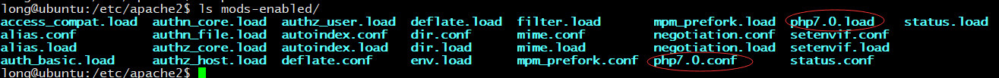

# 模拟数据生成器generatedata
generatedata是基于php开发，可自定义复杂的数据格式，支持多种文件导出的随机数据生成工具，它以列为单位来定义数据类型和取值范围，最终随机生成每一行数据。

## 下载
下载最新版本的[generatedata](http://benkeen.github.io/generatedata/install.html)webServer包。

## 部署
### 环境依赖
* php 5.3以上版本
* Mysql 4以上版本
* apache http服务

### 安装过程
#### 安装mysql数据库
```shell
yum -y install mariadb mariadb-server
```

#### 完成mysql初始化配置
```shell
[root@repo yum.repos.d]# mysql_secure_installation

Enter current password for root (enter for none):    #首次运行直接回车进入mysql
OK, successfully used password, moving on...

Setting the root password ensures that nobody can log into the MariaDB
root user without the proper authorisation.

Set root password? [Y/n] y        #是否设置root用户密码，输入y并回车或直接回车
New password:                     #设置root用户的密码
Re-enter new password:
Password updated successfully!
Reloading privilege tables..
 ... Success

Remove anonymous users? [Y/n] y   #是否删除匿名用户
 ... Success!

Normally, root should only be allowed to connect from 'localhost'.  This
ensures that someone cannot guess at the root password from the network.

Disallow root login remotely? [Y/n] n  #是否禁止root远程登录
 ... skipping.

By default, MariaDB comes with a database named 'test' that anyone can
access.  This is also intended only for testing, and should be removed
before moving into a production environment.

Remove test database and access to it? [Y/n] n   #是否删除test数据库
 ... skipping.

Reloading the privilege tables will ensure that all changes made so far
will take effect immediately.

Reload privilege tables now? [Y/n] y  #是否重新加载权限表
 ... Success!

Cleaning up...

All done!  If you've completed all of the above steps, your MariaDB
installation should now be secure.

Thanks for using MariaDB!
```

#### 登录mysql并创建数据库
```shell
[root@repo yum.repos.d]# mysql -u root -p
MariaDB [(none)]> create database csv_db;
Query OK, 1 row affected (0.00 sec)

MariaDB [(none)]> show databases;
+--------------------+
| Database           |
+--------------------+
| information_schema |
| csv_db             |
| mysql              |
| performance_schema |
| test               |
+--------------------+
5 rows in set (0.00 sec)
```

#### 查询用户及权限
```sh
# 查询所有用户的权限
SELECT DISTINCT CONCAT('User: ''',user,'''@''',host,''';') AS query FROM mysql.user;

# 查询指定用户的权限
SHOW GRANTS FOR 'username'@'%';
```

#### 安装php和httpd
```sh
yum install -y php httpd
```

#### 配置webServer
```sh
# 解压generatedata包
tar -zxvf benkeen-generatedata-3.2.8-1-ga5d6fea.tar.gz
mv benkeen-generatedata-a5d6fea generatedata
mv generatedata /home/

# 添加虚拟主机
vi /etc/httpd/conf.d/generate_data.conf
<VirtualHost *:8008>
 DocumentRoot "/home/generatedata"
 <Directory "/home/generatedata">
  Options FollowSymLinks
  AllowOverride None
  Require all granted
 </Directory>
</VirtualHost>

# 在httpd主配置文件中插入新增的虚拟主机配置文件
vi /etc/httpd/conf/httpd.conf
# Supplemental configuration
#
# Load config files in the "/etc/httpd/conf.d" directory, if any.
IncludeOptional conf.d/autoindex.conf
IncludeOptional conf.d/php.conf             #http新版本调整了主配置文件中关于php的配置项，需要手动加载
IncludeOptional conf.d/generate_data.conf
IncludeOptional conf.d/repos.conf
```

如果是在`ubuntu`中安装`apache2`作为http服务器，配置过程与上面类似，不过添加php支持的过程会有一些不一样，具体过程如下
```sh
#首先安装apache2，然后再添加php5支持
sudo apt-get install php7.0 libapache2-mod-php7.0
```

安装以后php的模块放到了mods-enabled目录下，会自动被加载的，然后把虚拟主机文件generate.conf放在sites-enabled中。


然后还有一点是添加监听端口8008，方法是编辑ports.conf文件增加虚拟主机端口8008。


#### 配置generatedata
通过 http://192.168.70.200:8008 进入generatedata主页，填写`mariadb`的连接信息
```config
url:localhost
db:csv_db
name:root
pwd:******
```

然后下一步完成`setting.php`文件的自动创建，这些有以下两点需要注意
* php页面所在目录中的`cache`目录的权限必须设置为777
* php页面所在目录必须允许`other`用户写入，因为httpd或apache2默认均是以apache用户启动的，并会在该目录中创建setting.php配置文件
